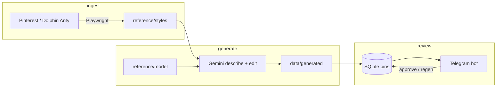

# Fashion Pin Review Bot

Human-in-the-loop pipeline that scrapes outfit references, generates try-on style images with Gemini, stores state in SQLite, and routes candidates to a Telegram review UI (approve / regen / pose / custom prompt).

Built as a **DevOps-ready automation lab**: containerized runtime, Compose for VPS deploy, GitHub Actions CI (lint + unit tests + image build), env-based config, and secret-safe logging.

> No auto-posting to Pinterest. An operator always reviews before anything leaves the queue.

---

## Architecture



| Stage | Responsibility |
|-------|----------------|
| Scrape | Refresh outfit refs via Playwright (optional Dolphin Anty profile) |
| Generate | Describe style → image edit with local model face (gemini_webapi + cookies) |
| Persist | Pin metadata + paths in SQLite (`data/pins.db`) |
| Review | Telegram inline keyboard; queue capped so generation pauses when pending |

---

## Tech stack

- **Python 3.11** · `python-telegram-bot` · Playwright · OpenCV / MediaPipe · Pillow · SQLite  
- **Containers:** Docker + Compose (non-root image, healthcheck)  
- **CI/CD:** GitHub Actions — Ruff, unit tests (mocked / no live APIs), Docker build with Buildx cache  
- **Config:** `.env` / `.env.example` · optional Dolphin Anty API URL for host↔container

---

## Quick start (local)

```bash
git clone <your-repo-url> fashion-pin-bot
cd fashion-pin-bot
python -m venv .venv
# Windows: .venv\Scripts\activate
source .venv/bin/activate
pip install -r requirements.txt -r requirements-dev.txt
playwright install chromium
cp .env.example .env   # set TELEGRAM_BOT_TOKEN + TELEGRAM_CHAT_ID
```

1. Place a face photo at `reference/model/model.jpg` (never commit real photos).  
2. Save Gemini session: `python generators/save_gemini_session.py`  
3. Optional Pinterest session: `python pinterest/save_session.py`  
4. Run: `python main.py`  

On Windows you can also use `setup.bat`.

### Docker Compose (VPS-friendly)

```bash
cp .env.example .env   # fill secrets
mkdir -p data/generated reference/model reference/styles
# add model.jpg under reference/model/
docker compose up -d --build
docker compose logs -f bot
```

Volumes mount `./data` and `./reference` so cookies, DB, and media stay on the host. Dolphin on the host is reachable via `DOLPHIN_API=http://host.docker.internal:3001/v1.0`.

---

## Configuration

| Variable | Required | Description |
|----------|----------|-------------|
| `TELEGRAM_BOT_TOKEN` | yes | BotFather token |
| `TELEGRAM_CHAT_ID` | yes | Operator chat / group ID |
| `DOLPHIN_PROFILE_ID` | no | Use Dolphin Anty instead of bare Chromium |
| `DOLPHIN_API` | no | Default `http://localhost:3001/v1.0` |
| `LOG_LEVEL` | no | Default `INFO` |
| `GEMINI_*` | no | Timeouts / retries — see `.env.example` |

---

## Project layout

```
├── main.py                 # Bot + generation loop
├── pipeline.py             # Generate → DB → Telegram
├── config.py               # Env validation
├── tg_bot/                 # Review UI
├── generators/             # Gemini image pipeline + session save
├── pinterest/              # Scraper + session save
├── db/                     # SQLite schema / queue helpers
├── scripts/healthcheck.py  # Docker HEALTHCHECK
├── tests/                  # unittest (mocked + optional live)
├── Dockerfile
├── docker-compose.yml
├── Makefile
└── .github/workflows/ci.yml
```

---

## Tests & CI

```bash
# Safe for CI / offline
SKIP_LIVE_GENERATION=1 python -m unittest discover -s tests -p 'test_*.py' -v
ruff check .
```

Live Gemini E2E (local only): `RUN_LIVE_GENERATION=1 python -m unittest tests.test_generation_integration -v`

GitHub Actions on `main` / PRs:

1. Install deps → **Ruff** → **unit tests**  
2. **Docker build** (Buildx + GHA cache, no push)

---

## Security & ethics

- Secrets and cookies are gitignored; see [SECURITY.md](SECURITY.md).  
- Logs redact Telegram bot tokens in request URLs.  
- Scraping / unofficial Gemini clients may conflict with third-party ToS — use only for personal lab accounts you control.  
- Do not commit face photos, session JSON, or `.env`.

---

## CV / portfolio notes

Useful talking points for a DevOps interview:

- End-to-end **automation pipeline** with backpressure (pending queue limit)  
- **12-factor** config, secret hygiene, token-redacting logs  
- **Docker multi-stage style image**, non-root user, healthcheck, Compose for VPS  
- **CI gate**: lint + tests + reproducible image build  
- Clear separation of scrape / generate / review stages  

---

## License

MIT — see [LICENSE](LICENSE).
